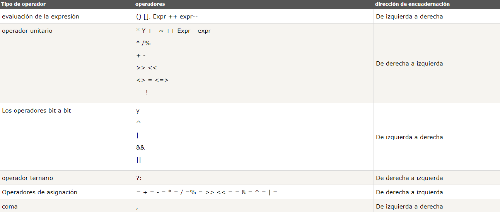
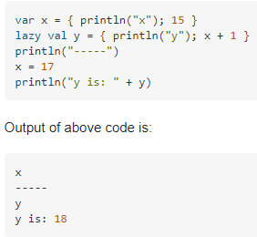

# DOCUMENTACION SCALA 

<b>0.INTRODUCCIÓN</b>    
Scala como lenguaje de programación es multi-paradigma y fue diseñado para expresar patrones comunes de programación de forma concisa, elegante y con tipos seguros. Teniendo características de lenguajes funcionales y orientados a objetos(OOP). Scala se ejecuta sobre la maquina virtual de java, con lo cual permite la unión con java. Esto es fantastico porque se puede programar en Java y Scala al mismo tiempo.
Algunas de las caracteristicas que definen Scala son:
<ul>

<li>Un punto fuerte es la escalabilidad que tiene, permitiendo crear tus propios frameworks y estructuras.</li>
<li>Su fuerte tipado estatico fuerza las abstracciones a usarse de forma coherente y segura. Esto detecta y evita muchos errores en compilación.</li>
<li>Tiene una gran productividad ya que ayuda a reducir el tamaño de código fuente en un gran porcentaje comparado con Java.</li>
<li>El ser un lenguaje funcional hace que la computación pueda distribuirse en servidores Data Center, con lo cual lo hace muy util para Big Data.</li>
<li>Es extensible, hace muy facil el uso de nuevas librerias.</li>

</ul>  

## 1.DEFINICIÓN DE FUNCIONES. 

Para definir una función se usa "def" y el nombre de la función. La declaración es muy similar a los lenguajes orientado a objetos ya que los parametros se colocan entre parentesis con su tipo. El operador ":" sirve para especificar dicho tipo, tanto de variables como de la propia función.

def functionName ([tipos]) : [return tipos] = {
   function body
   return [expr]
}

## 2.PRIORIDAD DE OPERADORES Y TIPOS. 

##  3.EVALUACIÓN PEREZOSA  
La evaluación perezosa, tambien llamada lazy evaluation o call-by-need, permite que un bloque de código sea evaluado sólo cuando se necesite, esto nos permite realizar código que tiene un rendimiento superior en ciertas situaciones
En scala, se utilizan los lazy val, que solo se evaluan cuando se utilizan por primera vez.  
                    

Las funciones tambien pueden declarar parametros de Evaluacion perezosa 
EJ: Y: => Any  

<b>EJERCICIO DE CLASE HASKELL</b>  
SoloPrimero::a->b->a
soloPrimero x _ = x

<b>SCALA</b>  
def soloprimero(x:Any, y: => Any) =  {  
println(x)   
}  
soloprimero(2,7/0)                               //> res0: Int = 2   

--Sin definir el parametro como perezoso este hace la operacion 7/0 Y DARIA ERROR  

<b> Otro ejemplo para entenderlo mejor </b>
 
def mul(x:Double ,y: => Double) = x*x                  

<b>Dentro de scala</b>  
mul(5,5+2)   //> NO EVALUA EL SEGUNDO PARAMETRO            //> res0: Double = 25.0 
5*5 
25 

SIN EVAULACION PEREZOSA  
mul(5,5+2)                                       //> EVALUA Y HACE LA SUMA DEL 5+2  
mul(5,7) 
5*5 
25 

## 4.FUNCIONES DE ORDEN SUPERIOR 
Las funciones de orden superior son aquellas que toman por parametros otras funciones, o devuelven como resultado una funcion.  

--definir funcion f: Double => Double
def FuncionValor(f: Double => Double, x: Double , y: Double , z: Double ) = {  
   function body  
   return [expr]  
}

def map (f: Int=>Int, l: List[Int]):List[Int] =
      if (l == Nil) l else f(l.head)::map(f,l.tail)
      

## 5.CURRIFICACIÓN  

La currificación es un mecanismo para la invocación parcial de funciones. Al llamar a una función normalmente le pasamos todos los parámetros y nos devuelve un resultado. Al invocarla parcialmente, le pasamos solo parte de esos parámetros y obtenemos una función. A esa otra función le pasamos el resto de parámetros para terminar obteniendo el resultado final.

<b> Ejemplo de clase </b>
def suma(a: Double, b: Double) = { 
  a+b  
} 
--si no ponemos un parametro da error---  

--Con currying devuelve una funcion con el parametro faltante--    
def suma2(x:Double)=(y:Double) => x + y         

val rest=suma2(1)                                 
rest(3)                                           //> res0: Double = 4.0  

