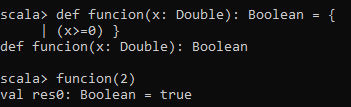
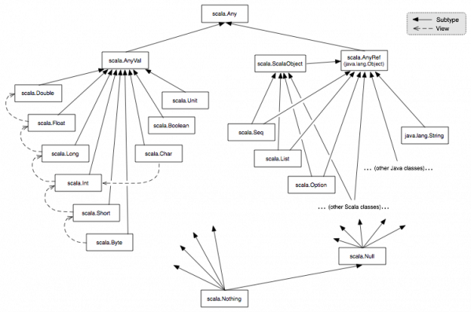

DOCUMENTACION SCALA

0.INTRODUCCIÓN
Scala como lenguaje de programación es multi-paradigma y fue diseñado para expresar patrones comunes de programación de forma concisa, elegante y con tipos seguros. Teniendo características de lenguajes funcionales y orientados a objetos(OOP). Scala se ejecuta sobre la maquina virtual de java, con lo cual permite la unión con java. Esto es fantastico porque se puede programar en Java y Scala al mismo tiempo.
Algunas de las caracteristicas que definen Scala son:
<ul>

<li>Un punto fuerte es la escalabilidad que tiene, permitiendo crear tus propios frameworks y estructuras.</li>
<li>Su fuerte tipado estatico fuerza las abstracciones a usarse de forma coherente y segura. Esto detecta y evita muchos errores en compilación.</li>
<li>Tiene una gran productividad ya que ayuda a reducir el tamaño de código fuente en un gran porcentaje comparado con Java.</li>
<li>El ser un lenguaje funcional hace que la computación pueda distribuirse en servidores Data Center, con lo cual lo hace muy util para Big Data.</li>
<li>Es extensible, hace muy facil el uso de nuevas librerias.</li>

</ul>

1.DEFINICIÓN DE FUNCIONES.

Para definir una función se usa "def" y el nombre de la función. La declaración es muy similar a los lenguajes orientado a objetos ya que los parametros se colocan entre parentesis con su tipo. El operador ":" sirve para especificar dicho tipo, tanto de variables como de la propia función.

2.PRIORIDAD DE OPERADORES Y TIPOS.

